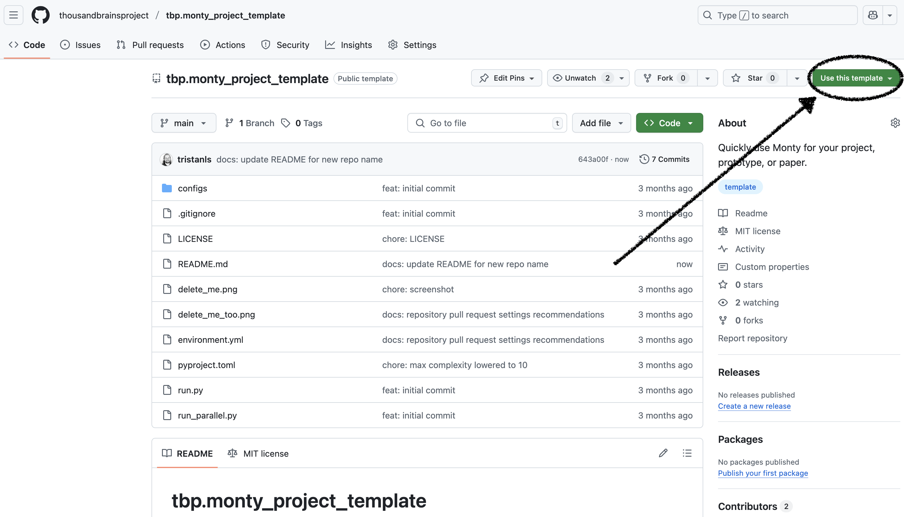
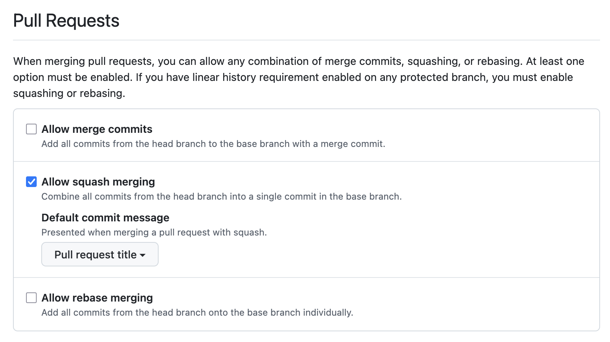

# tbp.monty_project_template

This is a template repository to quickly use [tbp.monty](https://github.com/thousandbrainsproject/tbp.monty) for your project, prototype, or paper.

To create a repository from this template, find and click the "Use this template" button:



## Make it yours

After copying the template, you need to address the following TODOs.

### `environment.yml`

- Update project `name`.
- Update `thousandbrainsproject::tbp.monty` version.
- Add any other dependencies.

### `pyproject.toml`

- Update the project `description`
- Update the project `name`
- Update the `Repository` and `Issues` URLs

### `src` directory

- Rename source path `src/tbp/monty_project_template` to match your `pyproject.toml` project `name`.

### Delete template images

- Delete `delete_me.png`
- Delete `delete_me_too.png`

### `README.md`

- Update for your project

### Recommendations

For a cleaner project commit history, go to your repository settings and in the Pull Requests section, only "Allow squash merging". It also helps to set your default commit message to the "Pull request title" option.



## Installation

The environment for this project is managed with [conda](https://www.anaconda.com/download/success).

To create the environment, run:

### ARM64 (Apple Silicon) (zsh shell)
```
conda env create -f environment.yml --subdir=osx-64
conda init zsh
conda activate project # TODO: Update to your project's name
conda config --env --set subdir osx-64
```

### ARM64 (Apple Silicon) (bash shell)
```
conda env create -f environment.yml --subdir=osx-64
conda init
conda activate project # TODO: Update to your project's name
conda config --env --set subdir osx-64
```

### Intel (zsh shell)
```
conda env create -f environment.yml
conda init zsh
conda activate project # TODO: Update to your project's name
```

### Intel (bash shell)
```
conda env create -f environment.yml
conda init
conda activate project # TODO: Update to your project's name
```

## Experiments

Define your experiments in the `src/tbp/monty_project_template/conf/experiment` directory
(your path will be different as it will match your project name).
You'll need to pass the `src/tbp/monty_project_template/conf` path as part of your run command
via the Hydra `-cd src/tbp/monty_project_template/conf` option.

After installing the environment, to run an experiment, run:

```bash
python run.py -cd src/tbp/monty_project_template/conf experiment=example
```

To run an experiment where episodes are executed in parallel, run:

```bash
python run_parallel.py -cd src/tbp/monty_project_template/conf experiment=example num_parallel=8
```

## Development

After installing the environment, you can run the following commands to check your code.

### Run formatter

```bash
ruff format
```

### Run style checks

```bash
ruff check
```

### Run dependency checks

```bash
deptry .
```

### Run static type checks

```bash
mypy .
```

### Run tests

```bash
pytest
```
